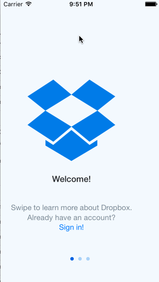

# Week 1 Assignment - *Dropbox*
Click-through flow of Dropbox

Submitted by: Sam Huskins

Time spent: 13 hours spent in total

## User Stories
**Required:**
* [x] User can tap through the 3 welcome screens
* [x] User can follow the create user flow
* [x] User can follow the sign in flow

**Optional:**
* [x] Add a detail view for one of the files and implement favoriting the file
* [ ] Add UITextFields for the forms so you can actually type in them and handle dismissing the keyboard
* [x] You should be able to swipe through the welcome screens instead of just tapping them

**Additional** 
* Paging control stays in one location and updates when scrolling through pages
* When favoriting a file in one view control, the image view in another view controler is updated by passing data through NSNotificationCenter

## Video Walkthrough 

Here's a walkthrough of implemented user stories:

GIF created with [LiceCap](http://www.cockos.com/licecap/).

## Notes

Had trouble getting page controls working based on how assignment laid it out, but was able to get it to work using another tutorial and a hack to hide static page control in assets. 

## License

Copyright 2016 Sam Huskins

Licensed under the Apache License, Version 2.0 (the "License");
you may not use this file except in compliance with the License.
You may obtain a copy of the License at

http://www.apache.org/licenses/LICENSE-2.0

Unless required by applicable law or agreed to in writing, software
distributed under the License is distributed on an "AS IS" BASIS,
WITHOUT WARRANTIES OR CONDITIONS OF ANY KIND, either express or implied.
See the License for the specific language governing permissions and
limitations under the License.
